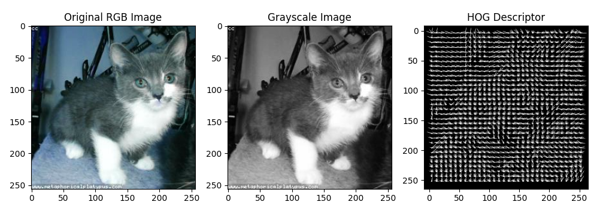
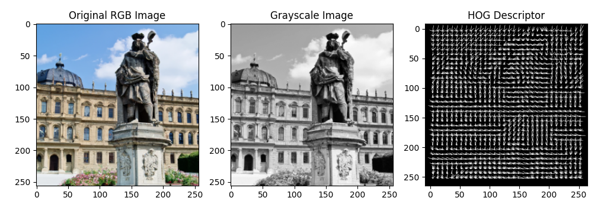

# Histogram of Oriented Gradients (HOG) Feature Extraction
## Getting Started
First of all, install the requirements:
```bash
pip install -r requirements.txt
```
In order to test the HOG descriptor start the jupyter notebook:

```bash
jupyter notebook
```


## Overview
The Histogram of Oriented Gradients (HOG) is a feature descriptor used in computer vision and image processing for the purpose of object detection. This repository contains an implementation of HOG feature extraction in Python, demonstrated on images of cats. The HOG descriptor focuses on the structure or the shape of an object. It works by dividing the image into small connected regions called cells, and for the pixels within each cell, a histogram of gradient directions or edge orientations is compiled.

## Visualizations
This repository includes visualizations of the HOG feature extraction process:

- The original grayscale image.
- Zoomed-in views of individual cells within the image, showing gradient orientations and magnitudes.
- A representation of the full HOG descriptor with vector fields indicating the predominant directions of gradients within each cell.



In the above visualization, we see the original grayscale image alongside the full HOG descriptor representation. Each arrow within the HOG descriptor image corresponds to a gradient orientation within a particular cell of the image. The length of the arrow represents the magnitude of the gradient in that direction.

### Zoomed-in Cell Visualizations
Here are zoomed-in visualizations of individual cells, showing the gradients and the HOG representation for different types of edges within the image.

#### Vertical Edges


#### Horizontal Edges


#### Circular Edges


Each zoomed-in view provides a detailed look at how gradients are calculated and represented in the HOG descriptor. These visualizations help in understanding the nature of the feature vectors generated by the HOG descriptor.

## OpenAI DALL-E 2 Example
Used prompt: _"Julius Maximilian in front of Würzburg's famous residence building with some green garden"_




## Implementation Details
The implementation is done using Python, utilizing libraries such as OpenCV for image processing, NumPy for numerical operations, and Matplotlib for visualizations. The steps involved in the process are:

1. Convert the image to grayscale.
2. Calculate the gradients in the x and y directions.
3. Compute the gradient magnitudes and orientations.
4. Divide the image into cells and, for each cell, compile a histogram based on the orientations and magnitudes.
5. Normalize the histograms to enhance invariance to lighting variations.

The Jupyter notebook `hog_feature_extraction.ipynb` included in this repository walks through the code, providing a step-by-step explanation of the HOG feature extraction process.

## Usage
To use this HOG feature extraction implementation:

1. Clone this repository.
2. Install the required dependencies.
3. Run the Jupyter notebook `hog_feature_extraction.ipynb`.

## License
This project is open-sourced under the MIT license.

Feel free to clone, modify, and use the code in your own projects. If you find this project useful, please consider starring it on GitHub.
